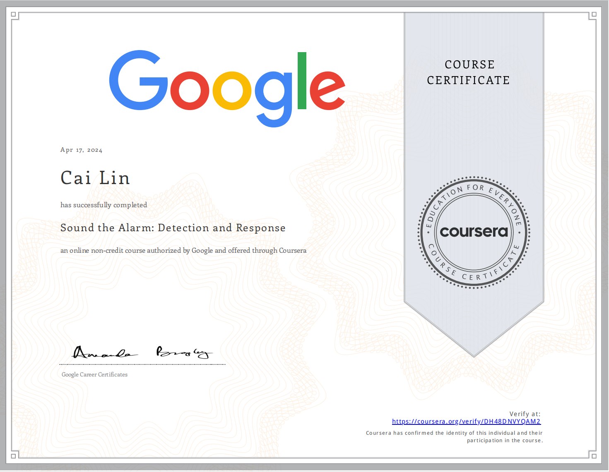

# Assets-Threats-and-Vulnerabilities

## Module 1: Introduction to detection and incident response 

## Module 2: Network monitoring and analysis

## Module 3: Incident investigation and response

## Module 4: Network traffic and logs using IDS and SIEM tools

 

# Proof of Completion

